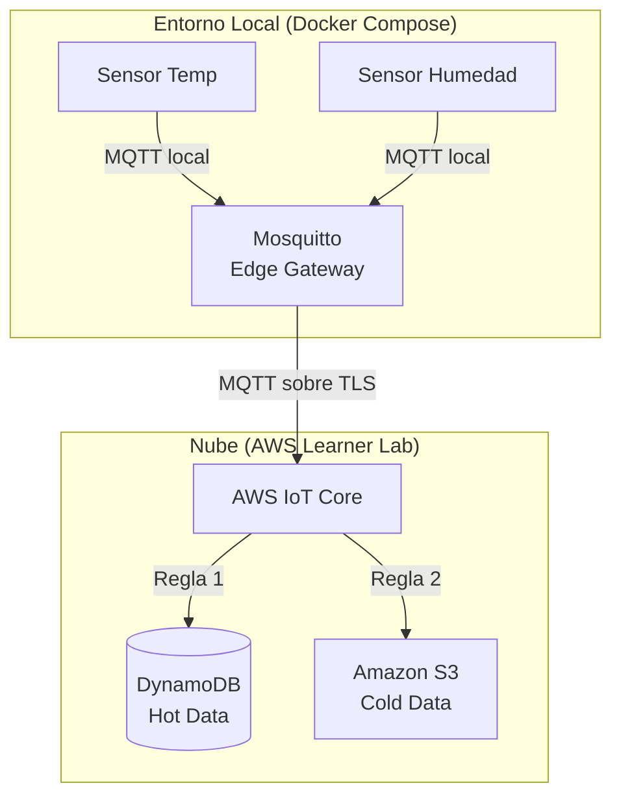
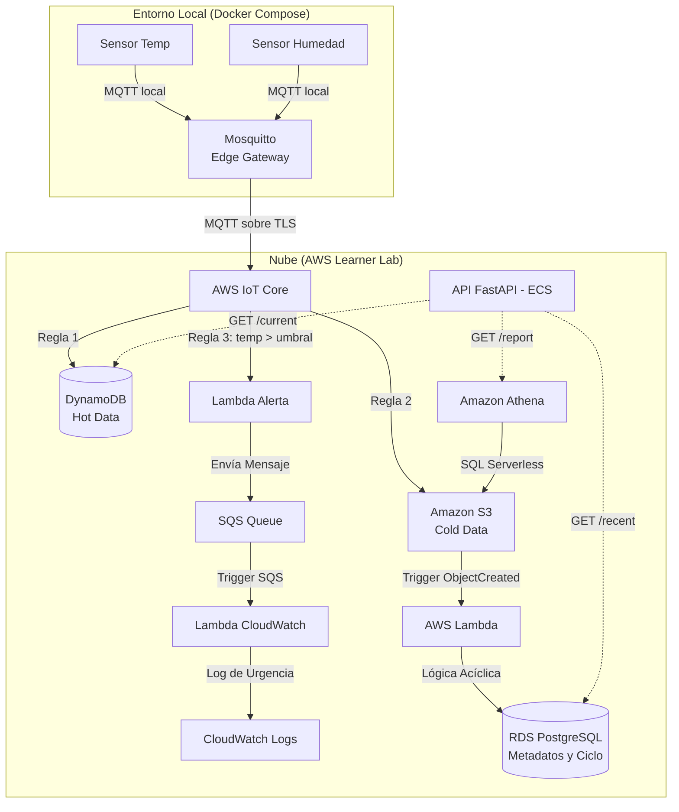

# Laboratorio Base: Edge Gateway (Docker) -> AWS IoT Core -> DynamoDB y S3 (Athena)

Este es el proyecto **BASE** que demuestra una arquitectura IoT usando el patrón **Edge Gateway**. 
A partir de este código, el objetivo práctico es que los alumnos evolucionen la infraestructura hasta convertirla en una Plataforma SaaS completa.

## Arquitectura Actual (Laboratorio Base)

Actualmente, el sistema simula múltiples sensores que envían datos por red local a un servidor Edge (Mosquitto MQTT). El Edge Gateway actúa como puente y reenvía los datos a **AWS IoT Core** usando certificados TLS. Desde ahí, los datos se enrutan simultáneamente a DynamoDB (Hot Data) y a S3 (Cold Data para Athena).



---

## Reto Práctico: Evolucionar a un Ecosistema IoT Completo

Como actividad integradora, deberás tomar esta arquitectura base y escalarla añadiendo una Capa de Lógica de Negocio y una API REST unificada.

### Arquitectura Objetivo

Al finalizar las actividades, tu arquitectura debe verse exactamente como el siguiente diagrama, incorporando una base de datos relacional, procesamiento sin servidor y una API:



### Actividades a Realizar

Para llegar a la Arquitectura Objetivo, debes completar los siguientes hitos usando Terraform y código local:

1. **Añadir RDS PostgreSQL:**
   Modificar el módulo de Terraform `modules/database/` para aprovisionar una base de datos Amazon RDS PostgreSQL (`db.t3.micro`). Configurar sus *Security Groups* para permitir acceso.
   
2. **Crear y Conectar AWS Lambda:**
   Crear una función Lambda en Python que se active automáticamente cuando un nuevo archivo JSON llegue al bucket de S3 (Trigger `s3:ObjectCreated:*`).

3. **Lógica de Mantenimiento Acíclico en Lambda:**
   Programar la Lambda para que lea el JSON de S3 y lo inserte en PostgreSQL usando una librería pura como `pg8000`. Además, la Lambda debe ejecutar una consulta `DELETE` para mantener únicamente los **últimos 10 eventos** de cada sensor, garantizando que la base relacional sea ligera y rápida.

4. **Desarrollar una API REST Unificada:**
   Construir una API (por ejemplo, con FastAPI) que unifique las tres bases de datos, exponiendo los siguientes endpoints:
   - `/sensor/{id}/current`: Obtiene el dato en tiempo real consultando **DynamoDB**.
   - `/sensor/{id}/recent`: Obtiene los últimos 10 eventos consultando **PostgreSQL**.
   - `/sensor/{id}/report`: Dispara una consulta analítica de Big Data en **Amazon Athena**, espera y retorna los resultados.

5. **Contenedorizar la API (Docker):**
   Crear un `Dockerfile` para tu API y añadirla como un nuevo servicio dentro del `docker-compose.yml` para que pueda ser consumida localmente por un cliente web o móvil en el puerto `8000`.

6. **Implementar Sistema de Alertas de Urgencia:**
   - Crear una `Regla 3` en AWS IoT Core que evalúe si la temperatura reportada supera un umbral crítico definido por ustedes (ej. `value > 35`).
   - La regla debe disparar una **Lambda de Alerta**, la cual enviará un mensaje con el formato de emergencia a una **Cola SQS**.
   - Configurar la cola SQS como *trigger* de una segunda **Lambda**, la cual consumirá el mensaje y escribirá un log de urgencia en **CloudWatch Logs**.

---

*(Debajo de esta línea se encuentran las instrucciones originales para ejecutar y probar el Laboratorio Base)*

---

## Requisitos
- Terraform instalado.
- Docker y Docker Compose instalados.
- Credenciales del AWS Learner Lab configuradas (ej. `~/.aws/credentials`).

---

## Paso 1: Desplegar Infraestructura Base en AWS

Usar el `Makefile` para automatizar el proceso.

1. Abrir la terminal en esta carpeta.
2. Ejecutar el despliegue a la nube:
   ```bash
   make aws-up
   ```
   *Nota:* Este comando crea la tabla en DynamoDB, los buckets en S3, y el *Thing* en IoT Core. Terraform también descarga los certificados TLS y crea un archivo de configuración de Mosquitto (`mosquitto.conf`) con el endpoint inyectado.

---

## Paso 2: Iniciar Sensores y Edge Gateway Locales

Con la nube configurada, levantar los contenedores locales.

1. Ejecutar:
   ```bash
   make local-up
   ```
   *Nota:* Esto levanta 3 contenedores de Docker en segundo plano:
   - `edge-gateway-mosquitto`: El servidor Mosquitto configurado como Bridge hacia AWS.
   - `sensor-temp-01`: Un script de Python simulando temperatura.
   - `sensor-humidity-01`: Un script de Python simulando humedad.

2. Ver el flujo de datos en vivo:
   ```bash
   make logs
   ```
   *(Presionar `Ctrl+C` para salir de los logs, los contenedores seguirán corriendo).*

---

## Paso 3: Verificar los datos en AWS

Mientras los contenedores corren y se envían datos:

### 1. DynamoDB (Hot Data)
- Ir a la consola de AWS -> **DynamoDB** -> **Tablas**.
- Hacer clic en `SensorData` -> **Explorar elementos de la tabla**.
- Observar eventos tanto de `sensor-temp-01` como de `sensor-humidity-01`.

### 2. Amazon Athena (Analítica)
- Ir a **Athena** -> **Query editor**.
- Ejecutar esta consulta para crear la tabla SQL apuntando al bucket de S3. *(Reemplazar `TU_BUCKET_SENSOR_DATA` por el nombre real del bucket que empieza con `learner-lab-sensor-data-`)*:

```sql
CREATE EXTERNAL TABLE IF NOT EXISTS sensor_data (
  device_id string,
  sensor_type string,
  value double,
  timestamp string
)
PARTITIONED BY (year string, month string, day string)
ROW FORMAT SERDE 'org.openx.data.jsonserde.JsonSerDe'
LOCATION 's3://TU_BUCKET_SENSOR_DATA/data/';
```

- Cargar las particiones:
```sql
MSCK REPAIR TABLE sensor_data;
```

- Ejecutar analítica:
```sql
SELECT sensor_type, AVG(value) as promedio
FROM sensor_data
GROUP BY sensor_type;
```

---

## Paso 4: Limpieza Total (Importante)

Para destruir tanto los recursos de AWS como los contenedores locales y limpiar los certificados:

```bash
make clean
```
