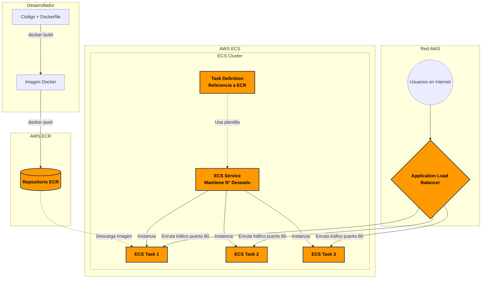

# Introducción a Amazon ECS (Elastic Container Service)

Amazon ECS es un servicio de orquestación de contenedores totalmente administrado que facilita el despliegue, la gestión y el escalado de aplicaciones en contenedores. 

## Componentes Principales

> [!NOTE]
> Estos son los bloques de construcción fundamentales que debes conocer para trabajar con ECS.

- **ECR (Elastic Container Registry):** Es el registro de contenedores de AWS, similar a Docker Hub, pero privado y seguro. Aquí se almacenan las imágenes Docker (como la imagen de tu sitio web) antes de ser desplegadas.
- **Cluster:** Una agrupación lógica de recursos (instancias o capacidad serverless) donde se ejecutan las tareas (contenedores).
- **Task Definition:** Es la "plantilla" o "receta" que describe cómo debe ejecutarse un contenedor. Aquí se define la imagen a utilizar, la cantidad de memoria, la CPU, los puertos, variables de entorno y el rol de IAM.
- **Task (Tarea):** Es la instanciación de un Task Definition. Es el contenedor en ejecución real que realiza el trabajo en la nube.
- **Service (Servicio):** Se encarga de mantener un número deseado de Tasks ejecutándose simultáneamente. Si una Task falla y se detiene, el Service levanta otra automáticamente para reemplazarla. También se encarga de registrar las tareas en el balanceador de carga.
- **Fargate:** Es un motor de cómputo *serverless* para contenedores. Con Fargate, no necesitas aprovisionar ni administrar los servidores subyacentes. Simplemente defines tu Task y AWS se encarga de asignar la infraestructura física necesaria bajo demanda.
- **EC2 (Elastic Compute Cloud):** A diferencia de Fargate, en este modelo tú creas y administras las máquinas virtuales (instancias EC2) donde ECS instalará los contenedores. Te da más control pero requiere de más esfuerzo de mantenimiento (actualizar OS, etc).
- **Load Balancer (ALB):** Distribuye el tráfico entrante de los usuarios en internet hacia las diferentes Tasks que están corriendo en el Cluster, asegurando alta disponibilidad.

## Pasos para desplegar un contenedor en ECS

> [!IMPORTANT]
> El ciclo de vida de un despliegue en ECS se compone generalmente de 5 pasos clave:

1. **Crear y Construir (Build):** Escribir tu aplicación y un archivo `Dockerfile`. Luego construyes la imagen Docker en tu máquina local o mediante un sistema de CI/CD.
2. **Subir al Registro (Push):** Autenticarte en AWS ECR mediante la terminal y empujar (*push*) la imagen construida al repositorio remoto de ECR.
3. **Definir la Tarea (Task Definition):** Crear un Task Definition en ECS referenciando la URI exacta de la imagen que acabas de subir a ECR.
4. **Configurar la Red y Balanceador:** (Opcional pero muy recomendado) Crear un Application Load Balancer y un Target Group para que el tráfico llegue correctamente a los contenedores.
5. **Crear el Cluster y Servicio:** Levantar un Cluster en ECS y, dentro de él, crear un ECS Service que instancie la "Task Definition" indicando cuántas réplicas deseas que estén en ejecución constante.

## Flujo de Despliegue y Arquitectura

A continuación se muestra un diagrama que ilustra cómo interactúan estos componentes desde el desarrollo hasta servir tráfico en producción.

