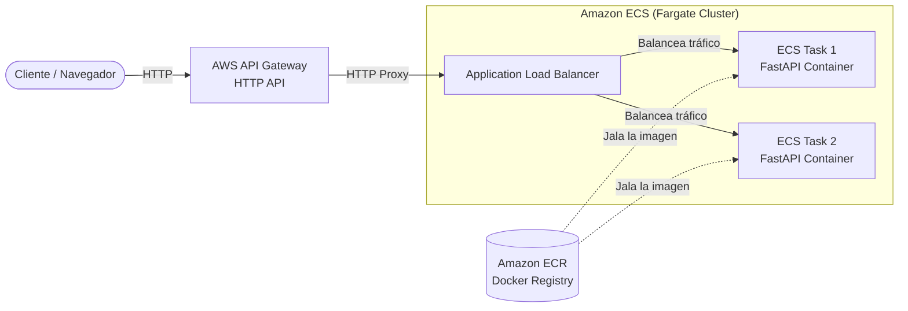
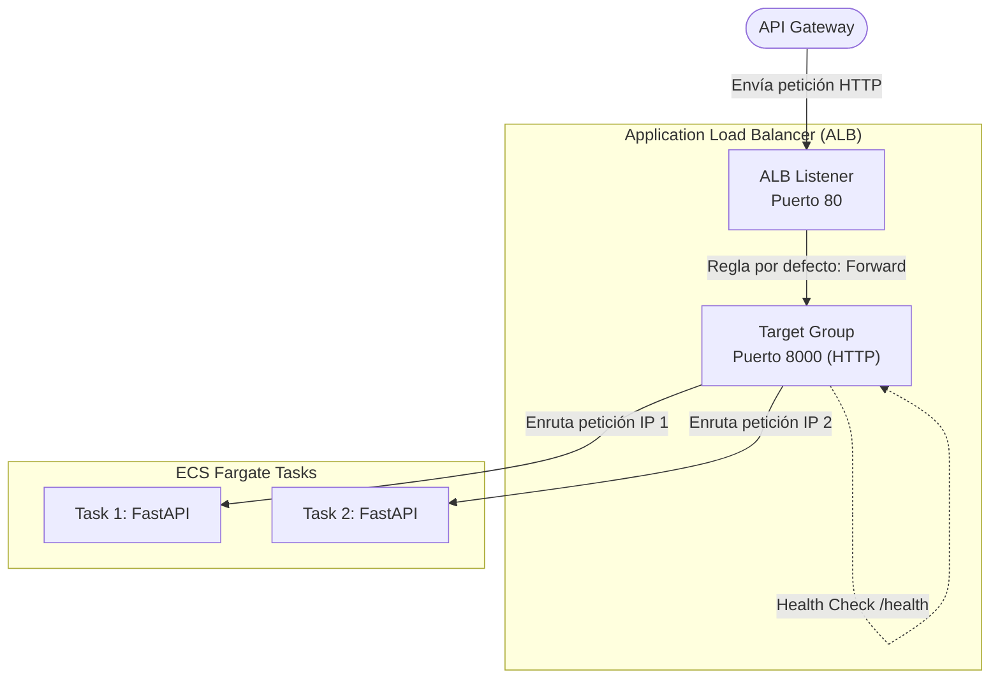
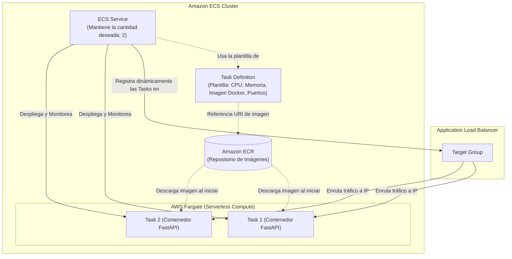

# Despliegue de API REST (FastAPI) en AWS ECS con Terraform

Este proyecto despliega una infraestructura serverless en AWS usando Terraform. Configura una API de FastAPI dentro de un contenedor en AWS ECS (Fargate), balanceada a través de un Application Load Balancer (ALB) y expuesta de forma segura mediante un API Gateway.

## Arquitectura



### Detalle del Balanceador de Carga (ALB)

El Application Load Balancer distribuye el tráfico hacia los contenedores en ECS de la siguiente manera:



### Detalle de los Componentes de ECS

El clúster de ECS funciona utilizando varios conceptos clave que orquestan los contenedores y los conectan al Load Balancer:



## Requisitos Previos

- Tener AWS CLI instalado y configurado con credenciales activas (para AWS Academy / Learner Lab, asegúrate de haber actualizado el archivo `~/.aws/credentials`).
- Tener Terraform instalado.
- Tener Docker instalado y corriendo.
    - En la imagen que se paso al inicio ya esta todo esto instalado

## Pasos de Despliegue

### Paso 1: Construir y Subir la Imagen de la API
El primer paso es crear el repositorio Elastic Container Registry (ECR) en AWS, construir la imagen de Docker de la API (ubicada en la carpeta `api/`) y subirla (*push*). Hemos creado un script que automatiza este proceso.

Asegúrate de darle permisos de ejecución al script y luego ejecútalo agregando el parámetro `--create-repo` para que cree el repositorio desde cero:

```bash
chmod +x build_and_push.sh
./build_and_push.sh --create-repo
```

### Paso 2: Inicializar Terraform
Inicializa el entorno de Terraform para descargar los plugins necesarios (como el provider de AWS).

```bash
terraform init
```

### Paso 3: Revisar el Plan de Ejecución
Antes de crear el resto de los recursos, es una buena práctica ejecutar `terraform plan` para ver qué es exactamente lo que Terraform va a crear en tu cuenta de AWS.

```bash
terraform plan -out=project.tfplan
```

### Paso 4: Desplegar el resto de la Infraestructura
Con la imagen ya disponible en ECR, podemos crear el clúster de ECS, el Load Balancer y el API Gateway.

```bash
terraform apply project.tfplan
```

Confirma escribiendo `yes` cuando Terraform te lo pregunte.

Al finalizar, verás en tu consola los `Outputs` de Terraform, parecidos a esto:

```text
Outputs:

alb_dns_name = "api-fastapi-alb-xxxxxx.us-east-1.elb.amazonaws.com"
api_gateway_url = "https://xxxxxx.execute-api.us-east-1.amazonaws.com"
ecr_repository_url = "123456789012.dkr.ecr.us-east-1.amazonaws.com/api-fastapi-repo"
```

## Probar la API

Puedes probar la API abriendo el navegador y visitando la URL proporcionada en el output `api_gateway_url`.

También hemos creado un script de Python llamado `invoke_api.py` para hacer pruebas rápidas de la API. Solo necesitas instalar la librería `requests` si no la tienes (`pip install requests`) y ejecutar el script pasando la URL del API Gateway.

```bash
python invoke_api.py https://xxxxxx.execute-api.us-east-1.amazonaws.com
```

## Limpiar y Destruir Recursos

Cuando termines de trabajar y quieras evitar cobros o consumo de saldo en tu Learner Lab, asegúrate de destruir todos los recursos creados.

```bash
terraform destroy
```


# Notas
## image_tag_mutability = "MUTABLE"
- **MUTABLE (Mutable/Modificable):**
    - Significa que puedes tener una etiqueta como latest o v1.0 y, si construyes una nueva versión de tu código y la subes con esa misma etiqueta, sobreescribirá la imagen anterior.
    - En nuestro caso usamos MUTABLE porque en el script build_and_push.sh estamos usando la etiqueta latest en cada despliegue (docker push $REPO_URI:latest).
    - Cada vez que ejecutes el script, la imagen de FastAPI se actualizará bajo la misma etiqueta latest.
- **IMMUTABLE (Inmutable/No modificable):**
    - Si se configura así, una vez que subes una imagen con la etiqueta v1.0, nunca más podrás subir otra imagen con esa misma etiqueta a ese repositorio. Si lo intentas, AWS te arrojará un error.
    - Esto se usa mucho en entornos de producción estrictos para garantizar que la etiqueta v1.0 siempre corresponderá exactamente a ese código específico y evitar que alguien lo reemplace por error. Si hicieras un cambio, tendrías que subirlo obligatoriamente con una nueva etiqueta, por ejemplo, v1.1.

## network_mode = "awsvpc"
- En AWS ECS, los contenedores pueden conectarse a la red de diferentes maneras (ej. bridge, host, none).
- Cuando usamos el modo awsvpc, le estamos diciendo a AWS: "Quiero que a este contenedor se le asigne su propia Interfaz de Red Elástica (ENI) privada y su propia dirección IP directamente desde la VPC, tal como si fuera una máquina virtual (EC2)".
- La ventaja de seguridad es que esto nos permite aplicarle al contenedor su propio Security Group (como lo hicimos en el archivo security_groups.tf), lo que aísla el contenedor y aumenta drásticamente la seguridad.
- Es un requisito obligatorio si vamos a usar Fargate.

## requires_compatibilities = ["FARGATE"]
- AWS ECS tiene dos modelos o "sabores" para ejecutar contenedores: EC2 y Fargate.
- Al establecer este valor en ["FARGATE"], le estamos indicando a AWS que no queremos gestionar servidores. Al configurar compatibilidad con Fargate, AWS asume toda la gestión de la infraestructura subyacente; y solo se paga por la CPU y Memoria exacta que consume el contenedor mientras esté encendido.