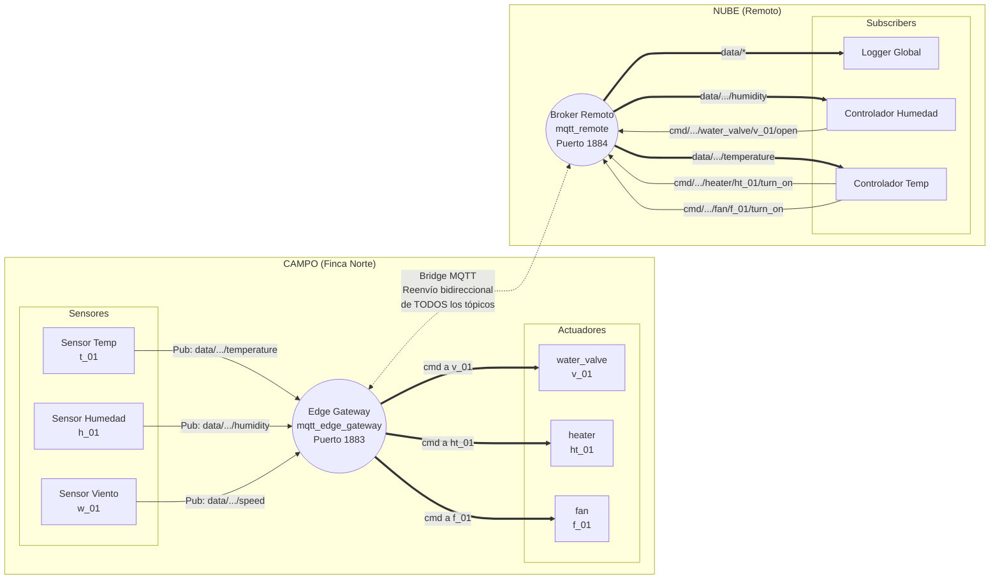

# Entorno Local IoT: Simulador Smart Agriculture con Edge Gateway (MQTT)

Este proyecto levanta un entorno local completo usando contenedores Docker para simular una arquitectura IoT realista con **dos brokers MQTT**: un **Edge Gateway** en el campo y un **Broker Remoto** en la nube. Se utilizan Tópicos Jerárquicos, Wildcards y un MQTT Bridge para comunicar ambos mundos. Todo programado en Python.

## Componentes

### Brokers MQTT
- **Edge Gateway (`mqtt_edge_gateway`):** Broker local instalado en la finca. Los sensores publican aquí y los actuadores se suscriben aquí. Actúa como **proxy** reenviando los mensajes al broker remoto usando un Bridge MQTT.
- **Broker Remoto (`mqtt_remote`):** Simula el broker en la nube/datacenter. Los subscribers (lógica de negocio) se conectan aquí para procesar datos y enviar comandos de vuelta.

### Dispositivos de Campo (conectan al Edge Gateway)
- **Publishers (Sensores Agrícolas):** 3 scripts independientes que simulan sensores de la granja `finca_norte`:
  - `sensor_temp`: Publica temperatura.
  - `sensor_humidity`: Publica humedad.
  - `sensor_wind`: Publica velocidad del viento.
- **Actuators (Actuadores):** Cada uno tiene un ID único y se suscribe al Edge Gateway esperando comandos:
  - `water_valve` (ID: `v_01`): Válvula de agua.
  - `heater` (ID: `ht_01`): Calentador.
  - `fan` (ID: `f_01`): Ventilador.

### Lógica en la Nube (conectan al Broker Remoto)
- **Subscribers (Controladores):** Utilizan wildcards para procesar datos y enviar comandos de vuelta:
  - `sub_all`: Logger global suscrito a `#`.
  - `sub_humidity`: Suscrito a `data/+/sensor_humidity/+/humidity`. Si humedad < 30%, envía comando `OPEN` a `v_01`.
  - `sub_temperature`: Suscrito a `data/+/sensor_temp/+/temperature`. Si Temp < 15°C activa `ht_01`, si Temp > 30°C activa `f_01`.

## ¿Cómo funciona el Bridge MQTT?

El Edge Gateway tiene configurado un **Bridge** (puente) hacia el broker remoto. Esto hace que:

1. **Datos de sensores** publicados en el Edge Gateway son automáticamente reenviados al Broker Remoto, donde los subscribers los procesan.
2. **Comandos de los subscribers** publicados en el Broker Remoto son automáticamente reenviados de vuelta al Edge Gateway, donde los actuadores los reciben.

Esto simula exactamente la arquitectura que se usa en producción con AWS IoT Core, donde el Edge Gateway en una finca reenvía datos a la nube y recibe comandos de vuelta.

## Arquitectura Completa



## Flujo de Datos Detallado

### Flujo de Telemetría (Sensor → Nube)
```
Sensor (campo)  →  Edge Gateway  →  [Bridge MQTT]  →  Broker Remoto  →  Subscriber (nube)
```

### Flujo de Comandos (Nube → Actuador)
```
Subscriber (nube)  →  Broker Remoto  →  [Bridge MQTT]  →  Edge Gateway  →  Actuador (campo)
```

### Escenario 1: Humedad Crítica → Válvula de Agua `v_01`
```
sensor_humidity  →  Edge Gateway  →  Bridge  →  Broker Remoto  →  sub_humidity
sub_humidity     →  Broker Remoto  →  Bridge  →  Edge Gateway   →  water_valve (v_01) ABRE
```

### Escenario 2: Temperatura Fría → Calentador `ht_01`
```
sensor_temp      →  Edge Gateway  →  Bridge  →  Broker Remoto  →  sub_temperature
sub_temperature  →  Broker Remoto  →  Bridge  →  Edge Gateway   →  heater (ht_01) ENCIENDE
```

### Escenario 3: Temperatura Alta → Ventilador `f_01`
```
sensor_temp      →  Edge Gateway  →  Bridge  →  Broker Remoto  →  sub_temperature
sub_temperature  →  Broker Remoto  →  Bridge  →  Edge Gateway   →  fan (f_01) ENCIENDE
```

## Tabla de IDs de Actuadores

| Actuador | Device ID | Tópico de Escucha |
| :--- | :--- | :--- |
| `water_valve.py` | `v_01` | `cmd/+/water_valve/v_01/open` |
| `heater.py` | `ht_01` | `cmd/+/heater/ht_01/turn_on` |
| `fan.py` | `f_01` | `cmd/+/fan/f_01/turn_on` |

## Instrucciones de Uso

1. **Limpiar entorno anterior y levantar el nuevo:**
   ```bash
   make clean
   make up
   ```

2. **Ver la simulación en tiempo real (Logs Globales):**
   ```bash
   make logs
   ```
   
3. **Ver logs específicos de los actuadores:**
   ```bash
   make logs-actuator
   make logs-heater
   make logs-fan
   ```

4. **Detener el entorno:**
   ```bash
   make down
   ```

5. **Eliminar todo (contenedores + imágenes):**
   ```bash
   make clean
   ```
